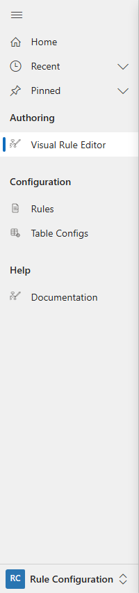

# Opening the Rule Builder

The **Rule Builder** is the full-page visual editor for rules: conditions,
actions, and data models.

## Sitemap

Open the model-driven app and use the **Authoring** group in the sitemap,
under the **Visual Rule Editor** subarea.

Selecting it opens the **hub** (the "Rules & data model" landing page), where
you work with the rules and data models that already exist. See
*The Hub* for what's on that page.

> The editor only runs inside the app frame: it relies on the app's client
> API for its data access. Don't try to open it as a bare standalone page;
> it will load but won't be able to read or save anything.
