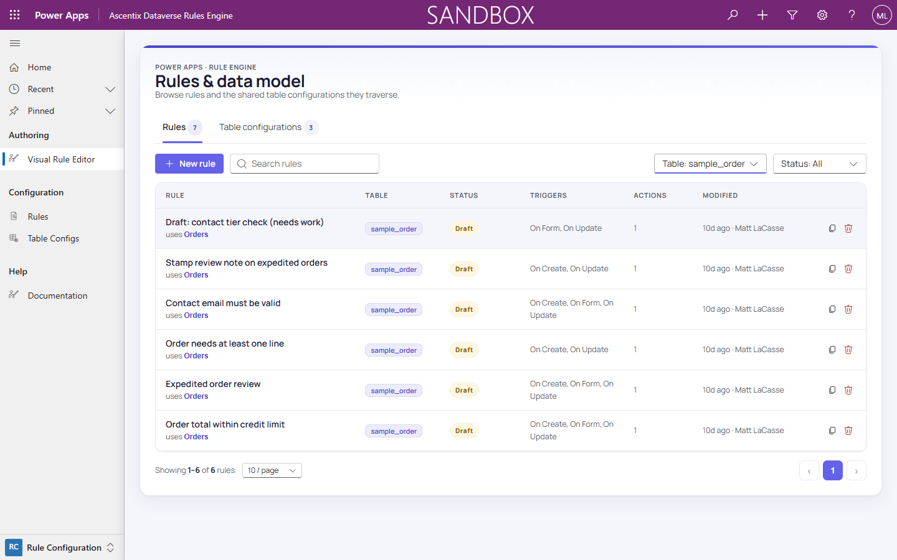

# The Hub

The hub, titled **Rules & data model**, is the Rule Builder's landing page. It
has two tabs: **Rules** and **Table configurations**.

## Rules tab

The Rules tab lists every rule with:

- **Rule name**, and the table configuration it uses underneath.
- **Table**: the table the rule's root table configuration is built on.
- **Status**: Draft, Published, or Archived. See *Rule Lifecycle* for what
  each status means.
- **Triggers**: the events the rule responds to. See *Triggers & Channels*.
- **Actions**: the rule's action count.
- **Modified**: when the rule was last changed, and by whom.

Clicking a row opens that rule directly in the editor. See *Editor Layout*
for what you land on.

Above the list sit **New rule** (see *Creating a New Rule*), **Search rules**,
and the **Table** and **Status** filters.

## Table configurations tab

The Table configurations tab lists the shared table-config trees. A table
configuration can be reused across multiple rules, so it is managed here
rather than inside any one rule.
