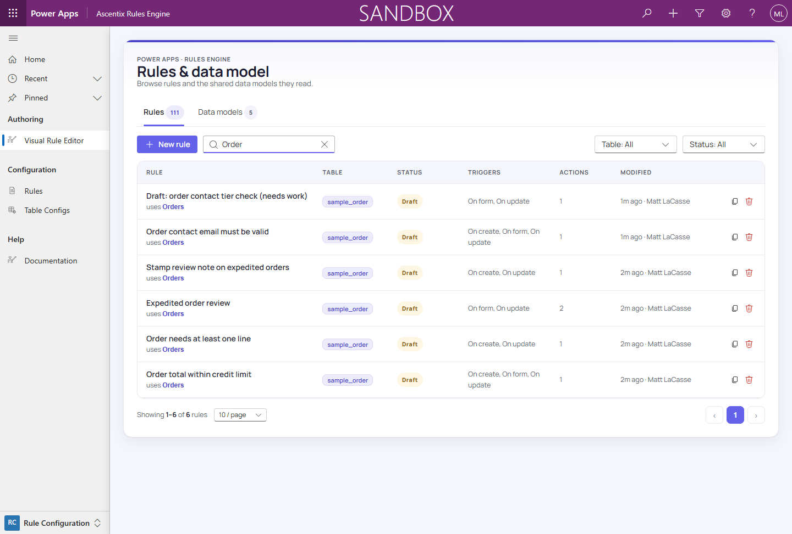

# The Hub

The hub, **Rules & data model**, is the Rule Builder's landing page. It has two tabs: **Rules** and
**Data models**.

## Rules tab

| Column | Shows |
|---|---|
| **Rule** | The rule's name, and the data model it uses. |
| **Table** | The table the rule runs on. |
| **Status** | Draft, Published or Archived (*Rule Lifecycle*). |
| **Triggers** | When it runs (*Triggers & Channels*). |
| **Actions** | How many actions it has. |
| **Modified** | When it last changed, and by whom. |

Click a row to open the rule (*Editor Layout*). Above the list: **New rule** (*Creating a New
Rule*), **Search rules**, and the **Table** and **Status** filters.

While a data update is waiting, a bar reads *Read-only until Update N is applied.* and **New rule**,
**Duplicate** and **Delete** are hidden. A System Administrator or System Customizer sees **Apply
now** (*Data Updates*).

## Data models tab

Data models (the table trees rules read through) are shared between rules, so they're managed here.
Editing one affects every rule that uses it.

| Column | Shows |
|---|---|
| **Data model** | Its name and root table. |
| **Root table** | The table it starts from. |
| **Tables** | How many tables it reaches. |
| **Used by** | How many rules use it, or **Unused**. |
| **Modified** | When it last changed. |

**Delete** is disabled while any rule uses the model. Above the list: **New data model**, **Search
data models**, and a **Root table** filter. Click a row to open the model (*Table Configuration
Tree*).
