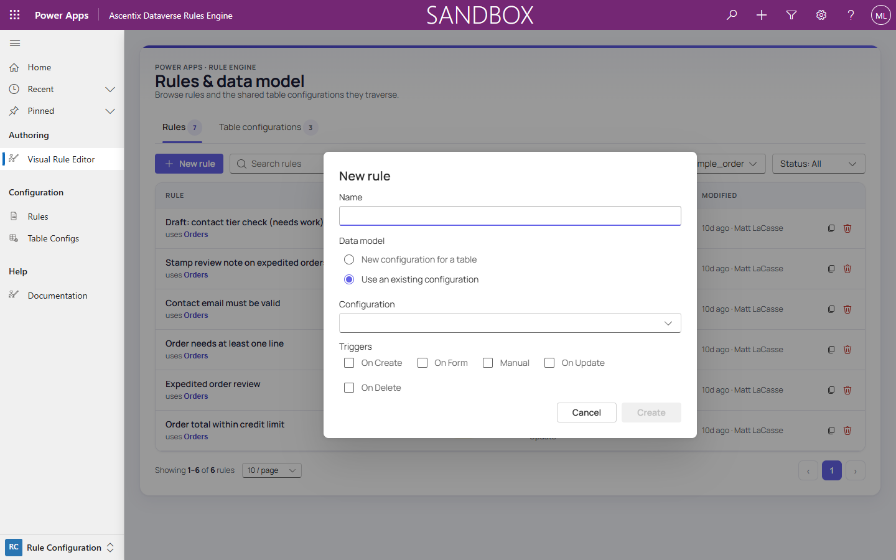

# Creating a New Rule

A rule starts with the table configuration it will run against.

## Steps

1. On the hub's Rules tab, click **New rule**.
2. Enter a **Name** for the rule.
3. Choose a **Data model**:
   - **New configuration for a table**: start a fresh table-config tree. A
     **Configuration name** field appears for the new tree, plus a **Table**
     picker for the root table.
   - **Use an existing configuration**: reuse a table-config tree that's
     already shared by another rule, chosen from a **Configuration** dropdown.
4. Select at least one **Trigger**: **On Create**, **On Form**, **Manual**,
   **On Update**, or **On Delete**. See *Triggers & Channels* for what each
   one means. **Create** stays disabled until at least one is checked.
5. Click **Create**. The new rule opens in the editor, in **Draft** status.

## New configuration vs. existing configuration

- Pick **New configuration for a table** when this rule needs a data shape
  no other rule has defined yet: a table config tree naming the table plus
  whatever lookup/child nodes the rule's conditions and actions will need to
  reach.
- Pick **Use an existing configuration** when another rule already built the
  tree you need. Table configurations are shared, so reusing one keeps rules
  on the same table consistent with each other, and any future extension to
  that tree (a new node) becomes visible to every rule using it.

See *Editor Layout* for how the resulting table-config tree shows up in the
editor, and *Table Configuration Tree* for how to extend one.

## Fire on change of specific columns

Once the rule exists, its **Properties** (see *Editor Layout*) expose a
**Fire on change of these columns** multi-select, listing the root table's
columns. This setting applies **only when the On Update trigger is
selected**.

By default, an On Update rule only re-fires when a column referenced by its
**conditions** changes. Trigger columns are **added** to that set: pick a
column here and the rule *also* fires when that column changes, even though
no condition reads it.

This matters when a rule's **actions** depend on a column its conditions
don't reference. A rule on `sample_orderline` uses an aggregate action to
compute `sum(lines.lineamount)` onto the order, but its conditions never
reference the line amount. Without a trigger column, editing a line's amount
wouldn't re-run the rule, and the computed total would go stale.

See *Triggers & Channels* for the full trigger model, and *Field Mapping*
for the aggregate action used in this example.
