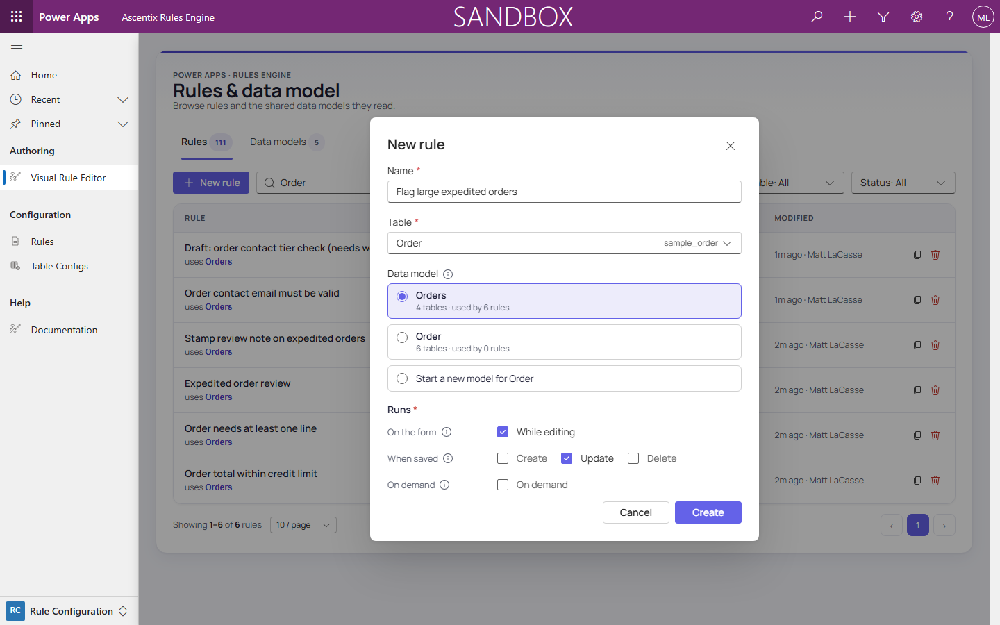

# Creating a New Rule

1. On the hub's **Rules** tab, click **New rule**.
2. Enter a **Name** and pick the **Table** the rule runs on.
3. Choose a **Data model**:
   - an existing model on that table (most-used first, the first one preselected), or
   - **Start a new model for** *table name*, named after the table. Rename it later in the data
     model editor.
4. Under **Runs**, tick at least one trigger (*Triggers & Channels*):

   | Group | Options |
   |---|---|
   | **On the form** | **While editing** (On form) |
   | **When saved** | **Create**, **Update**, **Delete** |
   | **On demand** | **On demand** |

5. Click **Create**. The rule opens in the editor as a **Draft**. If something is missing, the
   dialog says what (*Enter a name.*, *Choose a table.*, *Choose at least one.*).

## New or existing data model

Reuse an existing model when another rule already reaches the tables you need: rules on the same
table stay consistent, and a table added to the model is available to all of them. Start a new one
when no model has the shape you need (*Table Configuration Tree*).

## Also run on update when specific columns change

An On update rule normally runs again only when a column its **conditions** read changes. With **On
update** ticked, the rule's **When it runs** settings show **Also run on update when these change**:
pick columns there and the rule also runs when they change.

Use it when an **action** depends on a column the conditions don't read. For example, a rule on
`sample_orderline` whose action totals `lines.lineamount` onto the order must also run when a line's
amount changes, or the total goes stale (*Field Mapping*).
