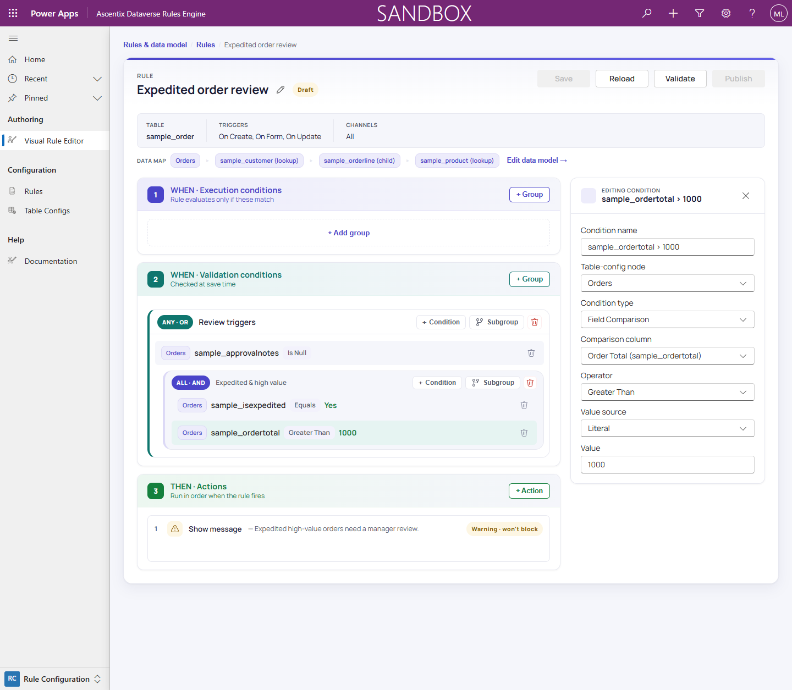

# Building Conditions

Conditions are what a rule checks. They appear in two zones,
**WHEN · Execution conditions** and **WHEN · Validation conditions**, which
use the same building blocks and differ only in their role in the rule (see
*Editor Layout*).

## Condition groups

Conditions live inside **condition groups**, and every group combines its
children one of two ways:

- **ALL · AND**: every condition (and subgroup) in the group must match.
- **ANY · OR**: at least one condition (or subgroup) in the group must match.

Groups can **nest**: a group can hold subgroups as well as direct
conditions, so you can build arbitrarily deep AND/OR trees. An **ANY · OR**
group holding a direct condition and an **ALL · AND** subgroup matches if
either the direct condition matches, or every condition in the subgroup
does.

## Condition types

Each condition is one of four types:

- **Field Comparison**: compares a column against a value using a comparison
  operator. The default and most common type.
- **Row Count**: counts the related child rows at a child table-config
  node and checks the count against a **min** and/or **max**. Only valid on
  a child node. At Create of the parent record, Row Count evaluates the child
  rows existing at that instant (always zero for the record's own
  collections), so a minimum-row rule blocks the create unless **On Create**
  is omitted from its triggers. The validator flags this combination with a
  `STRUCT_ROWCOUNT_ON_CREATE` warning at authoring time.
- **Regex Match**: tests a text column against a regular expression, matching
  or not matching.
- **Calculation**: compares a numeric expression against a value using a
  numeric comparison operator. The expression can aggregate child collection
  values and perform arithmetic.

## Comparison operators

For a Field Comparison condition, the **Operator** dropdown offers:

- **Equals**
- **Not Equals**
- **Greater Than**
- **Greater Than Or Equal**
- **Less Than**
- **Less Than Or Equal**
- **Contains**
- **Does Not Contain**
- **Is Null**
- **Is Not Null**

The editor only offers operators that suit the comparison column's data
type: ordering operators like Greater Than aren't offered for a text column,
and Contains/Does Not Contain aren't offered for a number column. `Is Null`
and `Is Not Null` are always available and ignore whatever's configured on
the value side.

`Is Null` matches both an explicitly-null value **and a column that is
absent from the record**: Dataverse omits null attributes entirely, so an
absent column is how "no value" actually looks at runtime, and `Is Null`
treats it as a match (while `Is Not Null` treats it as no match).

## Calculation conditions

A Calculation condition evaluates the arithmetic expression held in the
inspector's **Calculation** field and compares the result against a value:
"order total is greater than 1000," or "average line item discount is less
than 5%." Only the six numeric operators apply (Equals, Not Equals, Greater
Than, Greater Than Or Equal, Less Than, Less Than Or Equal). The right-hand
side uses the same **Value source** options as a Field Comparison (Literal,
Field Reference, Text template, or Date calculation); see *Comparison Value
Sources*.

Expressions support:

- **Column references:** `{root.<column>}` for the triggering record,
  `{node:<tableconfig-guid>.<column>}` for related records.
- **Numeric literals:** e.g., `42`, `3.5`.
- **Arithmetic:** `+`, `-`, `*`, `/`, and `(` `)` for grouping.
- **Unary minus:** a leading `-` (e.g., `-{root.sample_value}`).
- **Aggregate functions:** `sum(node:<guid>.<column>)`,
  `avg(node:<guid>.<column>)`, `min(node:<guid>.<column>)`,
  `max(node:<guid>.<column>)`, and `count(node:<guid>)` to aggregate over a
  child collection.

For example: `sum(node:<lines>.lineamount) > 1000`.

**Insert field** exposes the related nodes and columns, inserting the
appropriate token at your cursor. **Insert aggregate** walks you through
selecting a function (sum, avg, min, max, count), the child collection, and
optionally the column to aggregate. Both use the same interface as the
Calculation field-mapping source; see the **Calculation** section in *Field
Mapping* for detailed examples and guidance on aggregate functions and
operand types.

If a calculation cannot be computed (a null operand, a divide-by-zero, or an
aggregate function returning an empty result such as `avg()` on an empty
child collection), **the condition is not satisfied** and the comparison
does not fire. The same holds if the right-hand side value is missing or
null.

## The condition inspector

Selecting a condition opens its inspector. Two of its fields are documented
nowhere else:

- **Table-config node**: which node in the data map tree this condition
  evaluates against (the root, or a lookup/child node reachable from it).
- **Comparison column**: the column to evaluate, for Field Comparison and
  Regex Match. Row Count replaces this section with min/max row fields;
  Calculation replaces it with the Calculation expression field.

The rest are Condition name, Condition type, Operator, Value source (Literal
by default), and Value.

See *Comparison Value Sources* for the rest of the value-source options, and
*Building Actions* for what happens once a group's conditions match.
