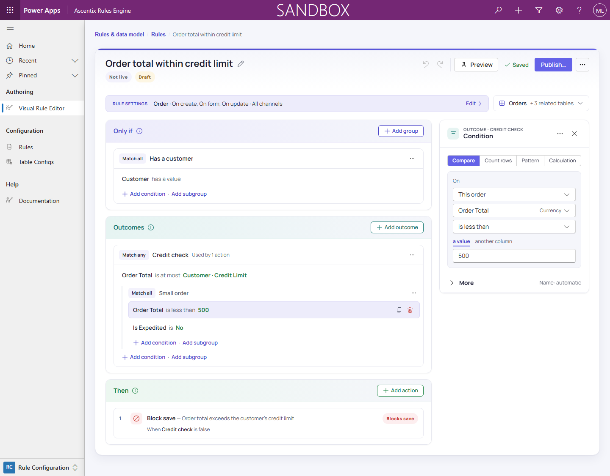

# Building Conditions

Conditions sit in two bands: **Only if** decides whether the rule runs, and **Outcomes** decides
what it reports (*Editor Layout*). Both are built the same way.

## Condition groups

Every group combines its contents one way, set with the **All** / **Any** toggle in its panel:

- **Match all**: everything in the group must match.
- **Match any**: at least one thing must match.

Groups nest. Inside a group, **Add condition** adds a condition and **Add subgroup** adds a group
inside it, so you can build any AND/OR tree.

Each condition reads as a sentence, such as *Order Total is more than 1,000*. Hover a condition for
**Duplicate condition** and **Delete condition**. A group's ⋯ menu has **Rename group**, **Match any
instead** (or **Match all instead**), **Duplicate** and **Delete group** (**Rename outcome** and
**Delete outcome** on an outcome).

## Outcomes

Each top-level group in **Outcomes** is an outcome: a named result, true or false, that actions test.
Click **Add outcome** to add one. Its panel has a **Name**, a **True when it matches** **All** /
**Any** toggle, and a **Used by** list of the actions that test it.

- The name is required, unique in the rule (ignoring case), and at most 100 characters.
- Every outcome is evaluated. One that no active action tests still runs, and publishing warns
  (`OUTCOME_UNUSED`).
- Subgroups and **Only if** groups aren't outcomes.

Deleting an outcome that actions test removes those tests; the **Delete outcome** dialog names the
actions. An action whose only test was that outcome becomes **Not set** and never fires until you
set its **When** (*Building Actions*).

## Condition types

Pick the type with the switch at the top of the condition panel:

| Type | Checks |
|---|---|
| **Compare** | A column against a value, with an operator. The default. |
| **Count rows** | How many related rows a child node has, against a minimum and/or maximum. Child nodes only. |
| **Pattern** | A text column against a regular expression (matches or doesn't). |
| **Calculation** | A numeric expression (arithmetic and totals over related rows) against a value. |

**Count rows on create**: when the parent record is created it has no related rows yet, so a
minimum-row rule blocks every create unless **On create** is left out of its triggers. The check
warns about this (`STRUCT_ROWCOUNT_ON_CREATE`).

## Operators

| Operator | Stored as |
|---|---|
| **is** / **is not** | Equals / Not Equals |
| **is more than** / **is at least** | Greater Than / Greater Than Or Equal |
| **is less than** / **is at most** | Less Than / Less Than Or Equal |
| **contains** / **doesn't contain** | Contains / Does Not Contain |
| **is empty** / **has a value** | Is Null / Is Not Null |

Only operators that suit the column's type are offered: no **is more than** for text, no
**contains** for numbers. **is empty** and **has a value** always appear and hide the value. **is
empty** also matches a column the record doesn't carry at all, which is how Dataverse sends an
empty value.

## Calculation conditions

A Calculation compares the result of an expression using one of the six numeric operators (**is**,
**is not**, **is more than**, **is at least**, **is less than**, **is at most**), against **a value**
or **another column** (*Comparison Value Sources*).

Expressions can use:

- `{root.<column>}` for the record being saved, `{node:<tableconfig-guid>.<column>}` for related
  records;
- numbers, `+ - * /`, parentheses, and a leading `-`;
- totals over a child collection: `sum(node:<guid>.<column>)`, `avg(…)`, `min(…)`, `max(…)` and
  `count(node:<guid>)`.

For example: `sum(node:<lines>.lineamount) > 1000`. **Insert field** and **Insert aggregate** insert
the tokens for you (more examples in *Field Mapping* → **Calculation**).

If the result can't be computed (an empty value, a divide by zero, `avg()` over no rows) or the
right-hand value is empty, the condition doesn't match.

**Filtering a total**: choose **Only rows where…** next to an aggregate to limit the rows it counts,
for example only open opportunities. Each aggregate has its own filter, so `sum(won) / sum(all)`
works as a ratio.

## The condition panel

Below the type switch, a Compare condition reads top to bottom as a sentence:

- **On**: the table in the data model it checks (*This* plus the table name for the record itself).
  Shown only when the model has more than one table.
- **Column**, **Operator**, the **Compare with** tabs (**a value** by default) and the value.

**Count rows** shows **Rows of** (the child table) and a **Count** choice (**has at least**, **has at
most**, **has between**, **has no**) instead. **Calculation** shows the expression box. The
**More** section holds **Condition name**; leave it blank to name the condition after what it
checks.

See *Comparison Value Sources* for the value options and *Building Actions* for how actions use
outcomes.
