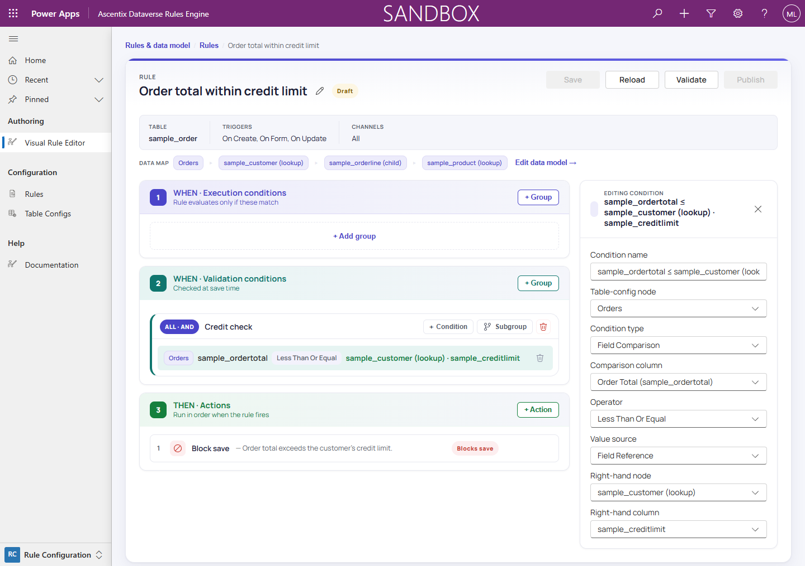

# Comparison Value Sources

A Field Comparison condition's right-hand side doesn't have to be a fixed
value. The **Value source** dropdown in the condition inspector controls
where it comes from.

## Literal

The default: a typed constant in the **Value** field, such as the `1000` in
`sample_ordertotal` Greater Than `1000`.

## Field Reference

The right-hand side is **another column**, on the condition's own record or
on a related table-config node. You might compare the order total against
the customer's credit limit rather than a hardcoded number.

Choosing Field Reference exposes two additional fields:

- **Right-hand node**: the table-config node the right-hand column lives on.
  Leave unset to compare against another column on the condition's own node.
- **Right-hand column**: the column on that node to compare against.

> The right-hand node must be **single-cardinality**: the root record or a
> node reachable through a lookup chain. A node under a one-to-many/child
> relationship isn't a valid Right-hand node.

## Text template

The right-hand side is built from **literal text combined with tokens**:
`{root.<column>}` for a column on the condition's own record, or
`{node:<node>.<column>}` for a column on a related table-config node. This is
the same token syntax used by Text template field mappings (see *Field
Mapping*). The template is resolved **at evaluation time**, against the
record actually being checked.

Choosing Text template exposes a template textarea, an **Insert field** menu,
and a preview of the rendered template.

> A template used as a comparison value is **fail-fast**: an unknown node, a
> malformed token, or a right-hand node that resolves to more than one record
> stops rule execution with a configuration error instead of comparing
> against unrendered text. Message tokens behave differently (see *Building
> Actions* → *Dynamic message text*).

## Date calculation

The right-hand side is a **computed date**: an anchor plus an offset.
Choosing Date calculation exposes:

- **Anchor**: either **"When the rule runs"** or a date column, on the
  condition's own record or on a related single-cardinality table-config
  node.
- **Op**: add or subtract.
- **Amount**: a positive whole number.
- **Unit**: minutes, hours, days, weeks, months, or years.

The result is a DateTime, compared against the comparison column using the
same operators as any other Field Comparison or Calculation condition (see
*Building Conditions*). A one-line summary shows the resolved expression, for
example "Created On + 3 days".

> If the anchor column is null, isn't a date, or the anchor node resolves to
> more than one related record, resolving the comparison fails as a
> configuration error rather than silently skipping the condition.
