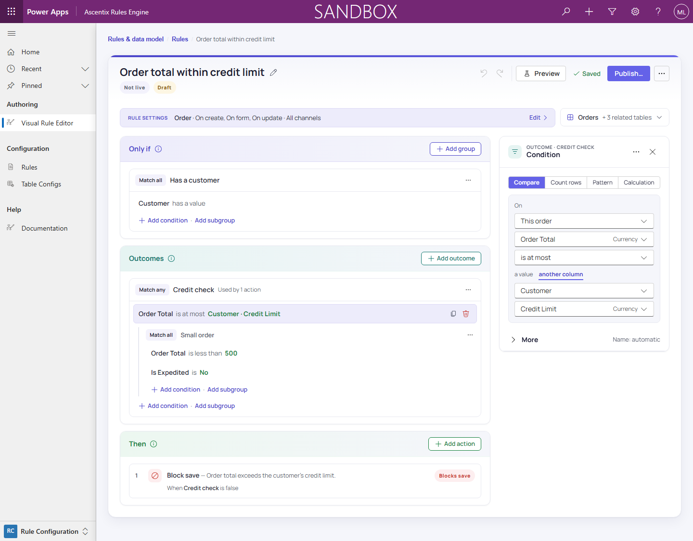

# Comparison Value Sources

The **Compare with** tabs under a Compare condition's operator choose where the right-hand side
comes from:

| Tab | Stored as | Compares against |
|---|---|---|
| **a value** | Literal | A typed value, such as `1000`. The default. |
| **another column** | Field Reference | A column on the same record or a related one. |
| **a text template** | Text template | Text built from fixed words and column tokens. Text columns only. |
| **a date calculation** | Date calculation | A date plus or minus an amount of time. Date columns only. |

## another column

Compare, for example, the order total with the customer's credit limit. Pick the record (**Same
record** by default, or a table in the data model) and the column. Only columns of a comparable
type are listed.

The other record must be **single**: the record itself or one reached through lookups, never a
child collection.

## a text template

Combine text with tokens: `{root.<column>}` for the record being checked, `{node:<node>.<column>}`
for a related record, the same syntax as Text template field mappings (*Field Mapping*). Use
**Insert field** to add tokens; a preview shows the result. The template is filled in when the rule
runs.

If a token is malformed, names an unknown node, or reaches more than one record, the rule stops
with a configuration error instead of comparing against unfilled text. (Message tokens behave
differently: *Building Actions* → *Dynamic message text*.)

## a date calculation

A date plus or minus an amount of time, for example "Created On + 3 days":

- **Anchor**: **When the rule runs**, or a date column on the record or a related single record.
- **Op**: add or subtract.
- **Amount**: a positive whole number.
- **Unit**: minutes, hours, days, weeks, months or years.

If the anchor is empty, isn't a date, or reaches more than one record, the rule stops with a
configuration error rather than skipping the condition.
