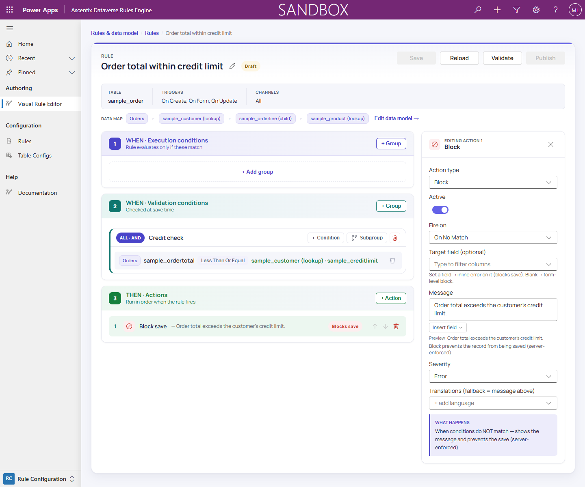

# Building Actions

Actions are the **THEN** layer of a rule: what happens once the validation
conditions have been checked.

## Fire on

Every action has a **Fire on** setting:

- **On Match**: the action fires when the rule's validation conditions
  match.
- **On No Match**: the action fires when they don't.

## Action types

- **Set Visible**: shows or hides a form field.
- **Set Required**: marks a form field required or not required.
- **Show Message**: surfaces a message to the user at a given severity.
  Never blocks a save.
- **Block**: prevents the save. Server-enforced.
- **Create Record**: creates a new record, with values from a field
  mapping.
- **Update Record**: updates a target record, with values from a field
  mapping.
- **Delete Record**: deletes a target record.

**Set Visible** and **Set Required** are form actions that use a
**Target field** to say which field they apply to. **Show Message** and
**Block** also take an optional **Target field**: set one and the
notification (or block) attaches to that field inline; leave it blank and
it applies at the form level instead: a form banner for Show Message, or
a form-level block for Block. **Show Message** and **Block** carry a
**Message** plus a **Severity** (Information, Warning, or Error).

> **What blocks a save is the action type, not the severity.** A **Block**
> action blocks the operation and rolls back at any severity, **Warning**
> included. A **Show Message** never blocks on the server, at any severity.
>
> On a form it is not that simple. A Show Message with a **Target field** is
> shown as a notification on the control, and the platform renders control
> notifications at Error only, so the platform's own validation stops the save
> until the condition stops matching. That happens whatever severity you set.
> A Show Message with no target field banners and does not block. See
> *Runtime Enforcement*.

## Dynamic message text

A **Block** or **Show Message** action's **Message** (and its per-language
**Translations**) can include the same tokens used elsewhere in the editor:
`{root.<column>}` for a column on the triggering record, or
`{node:<node>.<column>}` for a column on a related table-config node. Tokens
are rendered **at fire time**, from the record that actually matched. The
message editor has an **Insert field** menu and a preview of the rendered
token.

> If a token can't resolve (an unknown node, a malformed token, a related
> record that no longer exists), the message **degrades to the raw,
> unrendered text** rather than failing the rule. A template used as a
> condition's comparison value fails fast instead (see *Comparison Value
> Sources*).

## The action inspector

Selecting an action opens its inspector, where you configure:

- **Action type**: one of the seven types above.
- **Active**: a toggle to enable or disable the action without deleting
  it.
- **Fire on**: On Match or On No Match.
- **Target field**: as described above, required for Set Visible / Set
  Required and optional for Show Message / Block.
- **Value toggle**: for Set Visible / Set Required, the value to apply
  when the action fires (on means visible, or required).
- **Message**, **Severity** (Information, Warning, or Error), and
  **Translations** (per-language overrides for the message text), for Show
  Message and Block actions.

A **WHAT HAPPENS** explainer in the inspector summarizes what the
currently-configured action will do.

Create Record and Update Record actions replace the Message/Severity
fields with a field mapping. See *Field Mapping* for how to map target
columns to their values.
