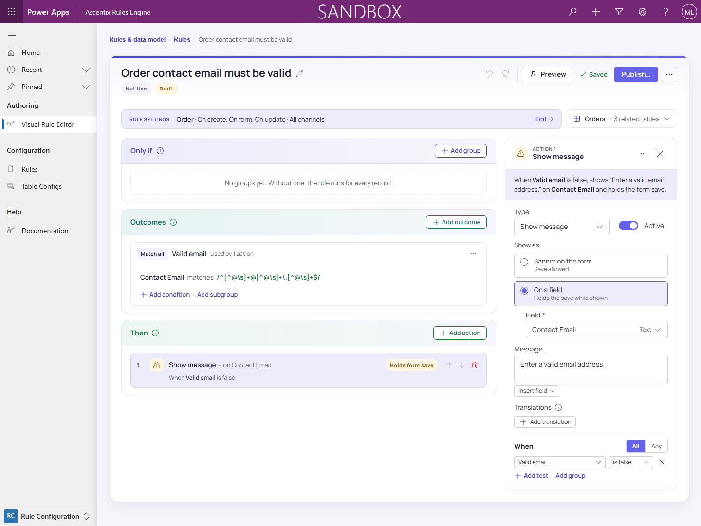

# Building Actions

Actions are the **THEN** layer of a rule: what happens once the validation
conditions have been checked.

## Fire on

Every action has a **Fire on** setting:

- **On Match**: the action fires when the rule's validation conditions
  match.
- **On No Match**: the action fires when they don't.

## Action types

- **Set Visible**: shows or hides a form field.
- **Set Required**: marks a form field required or not required.
- **Show Message**: surfaces a message to the user at a given severity.
  Never blocks a save.
- **Block**: prevents the save. Server-enforced.
- **Create Record**: creates a new record, with values from a field
  mapping.
- **Update Record**: updates a target record, with values from a field
  mapping.
- **Delete Record**: deletes a target record.
- **Deactivate Record**: makes the target record(s) inactive (`statecode` 1). Optionally sets a
  status reason; otherwise the table's default inactive status.

**Set Visible** and **Set Required** are form actions that use a
**Target field** to say which field they apply to. **Show Message** and
**Block** also take an optional **Target field**: set one and the
notification (or block) attaches to that field inline; leave it blank and
it applies at the form level instead: a form banner for Show Message, or
a form-level block for Block. **Show Message** and **Block** carry a
**Message** plus a **Severity** (Information, Warning, or Error).

> **What blocks a save is the action type, not the severity.** A **Block**
> action blocks the operation and rolls back at any severity, **Warning**
> included. A **Show Message** never blocks on the server, at any severity.
>
> On a form it is not that simple. A Show Message with a **Target field** is
> shown as a notification on the control, and the platform renders control
> notifications at Error only, so the platform's own validation stops the save
> until the condition stops matching. That happens whatever severity you set.
> A Show Message with no target field banners and does not block. See
> *Runtime Enforcement*.

## Dynamic message text

A **Block** or **Show Message** action's **Message** (and its per-language
**Translations**) can include the same tokens used elsewhere in the editor:
`{root.<column>}` for a column on the triggering record, or
`{node:<node>.<column>}` for a column on a related table-config node. Tokens
are rendered **at fire time**, from the record that actually matched. The
message editor has an **Insert field** menu and a preview of the rendered
token.

> If a token can't resolve (an unknown node, a malformed token, a related
> record that no longer exists), the message **degrades to the raw,
> unrendered text** rather than failing the rule. A template used as a
> condition's comparison value fails fast instead (see *Comparison Value
> Sources*).

## The action inspector

Selecting an action opens its inspector, where you configure:

- **Action type**: one of the eight types above.
- **Active**: a toggle to enable or disable the action without deleting
  it.
- **Fire on**: On Match or On No Match.
- **Target field**: as described above, required for Set Visible / Set
  Required and optional for Show Message / Block.
- **Value toggle**: for Set Visible / Set Required, the value to apply
  when the action fires (on means visible, or required).
- **Message**, **Severity** (Information, Warning, or Error), and
  **Translations** (per-language overrides for the message text), for Show
  Message and Block actions.

A **WHAT HAPPENS** explainer in the inspector summarizes what the
currently-configured action will do.

Create Record and Update Record actions replace the Message/Severity
fields with a field mapping. See *Field Mapping* for how to map target
columns to their values.

### When the record moves to another parent

A rule that runs on a record can update the record it points to, for example an opportunity's
contact. When a save **changes** that lookup (the opportunity moves from Ana to Ben), the rule sees
only the new contact. To keep the previous one up to date too, turn on **Also apply to the previous
Contact when it changes** on the Update Record action. The rule then runs a second time for Ana in
the same save, and only the actions with this option on are applied to her. Blocks and messages
apply only to the record being saved. A record that both the new and the previous parent lead to
(two orders under the same customer, say) can only be updated by the new one's run; the previous
one's run leaves it alone. The option only appears on Update Record actions whose target is
reached through lookups; if you later change the action so it no longer qualifies, the option is
hidden and saved as off. The second run writes with the rule's own evaluation context, so with a
User-context rule the person saving also needs write access to the previous record.

## Writing a set of rows

Update Record, Delete Record and Deactivate Record can target a **collection** (a node reached
through a child relationship, shown as "Contacts (each row)"). The action then writes **every row**
of that collection for the record being evaluated; a collection under a collection yields all of
its rows. A single-record target behaves as before.

**Rows.** A set action has a Rows filter (the same editor as a condition's "Only consider records
where…"). The rule's conditions decide *whether* the action fires; the Rows filter decides *which
rows* it writes. "Has none" and "has at least" work here, so "contacts with no open follow-up task"
is one filter. The filter is evaluated **in memory**, over the collection's rows already fetched in
full for the rule's own traversal — it doesn't narrow what's queried from Dataverse, only which of
the fetched rows the action writes. See *Beta Limitations* for the size this puts on a set action.

**Create per row.** Create Record's optional **For each row of** creates one record per filtered row
of a collection. Map values from the row with the **Current row** source, or `{row.<column>}` in a
text template; a lookup column can link to the row itself. There is no automatic duplicate check:
guard with a "has none" Rows filter. **For each row of** only appears once the rule has at least one
collection node in its table-config tree; on a rule with none, Create Record only ever creates one
record.

**How writes are combined.** Every write of one record's evaluation is collected first. Two actions
writing the same record **in the same evaluation context** (User or System) become one write (the
later action wins per column); an update and a delete of the same record become the delete. Writes
in different evaluation contexts stay separate, even for the same record. A row that already holds
the values is skipped, so saving again with nothing changed writes nothing. Writes go out as
creates, then updates, then deletes, grouped per table, in bulk where the table supports it — except
Deactivate Record, whose rows currently go one at a time regardless (*Beta Limitations*). A Block
anywhere still means nothing is written. Also apply to the previous parent is available only on a
single-record target.
