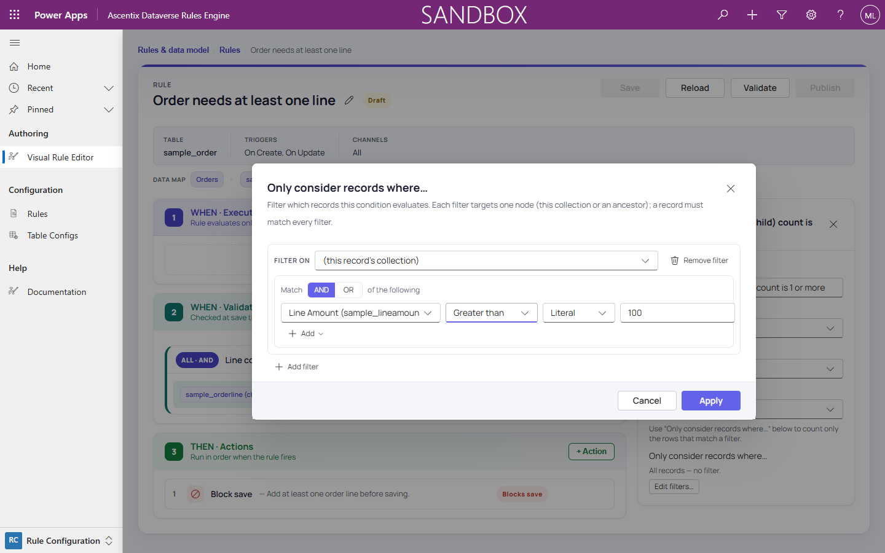
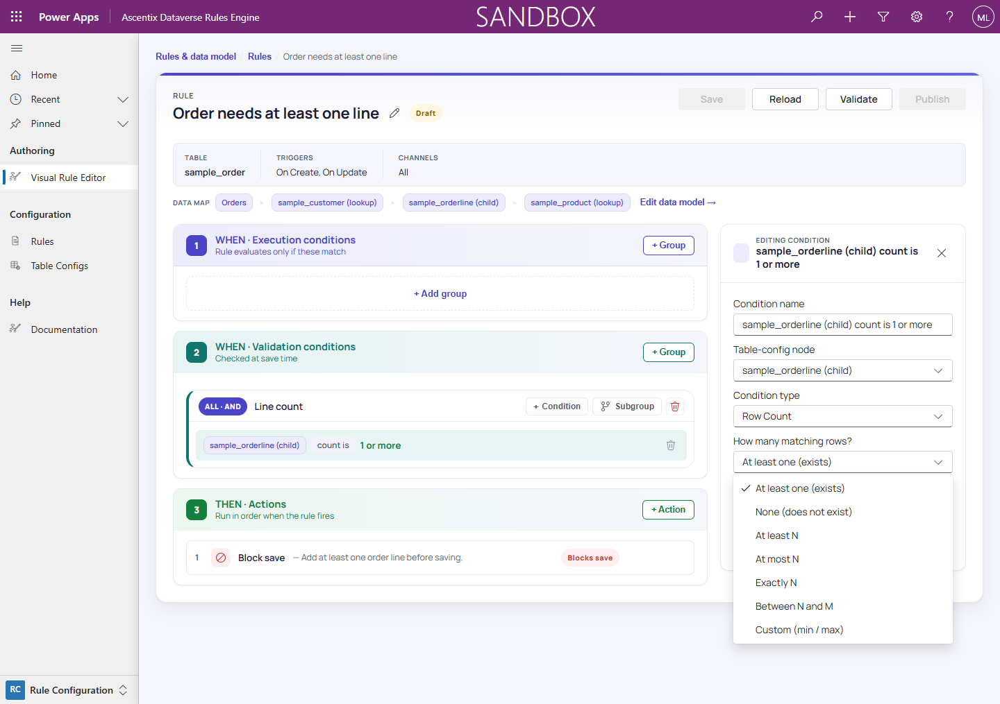

# Filtering a Condition's Child Records

When a condition targets a **child (collection) node**, the condition editor
offers an **"Only consider records where…"** section. The condition evaluates
only the child records that match the filter.

## How filters work

Each filter is a **block that targets one specific node** and specifies an
**AND/OR set of criteria** on that node's columns.

- **First filter targets the child node**: a new filter starts on the
  condition's own child node.
- **Add more filters**: each additional filter can target the same child node,
  or an **ancestor node** to filter by that related record's columns.
- **All filters must match**: a child record is evaluated only if it satisfies
  **all** filters you add. An ancestor filter acts as an additional constraint
  via the parent relationship.

## Supported operators

A filter's criteria support the same comparison operators as Field Comparison
conditions:

- **Equals**
- **Not Equals**
- **Greater Than**
- **Greater Than Or Equal**
- **Less Than**
- **Less Than Or Equal**
- **Contains**
- **Does Not Contain**
- **Is Null**
- **Is Not Null**

The editor only offers operators that make sense for the column's data type.

## Comparison values: literal or field reference

Each criterion's comparison value can be:

- **Literal**: a fixed value you type in.
- **Field reference**: read from a related record's column through a
  lookup-chain or single-record reference. For example, compare a line item's
  date against the order's due date.

## Examples

### Example 1: Filter child records by a column on the child node

A rule on **order lines** checks "every line **with status = Active** must have
amount > 0."

- Create a condition on the order-line node: `amount > 0`.
- Add a filter targeting the order-line node: `status Equals Active`.
- Result: only order lines with `status = Active` are checked.

### Example 2: Filter child records by a column on an ancestor node

A rule on **order lines** checks "every line must have amount > 0, but only for
orders in the **Northeast region**."

- Create a condition on the order-line node: `amount > 0`.
- Add a filter that targets the **parent order node**: `region Equals Northeast`.
- Result: only lines that belong to a Northeast order are checked.

## Has related rows… (existence filtering)

A filter's **Add ▾** menu offers **Condition**, **Group**, and a third option:
**Related-rows filter**. Adding one turns **the criterion** into an existence
check: the criterion is satisfied when another related collection has a **count
of matching rows** within a range you choose, instead of comparing a single
column.

This expresses "this order has at least one line item with status = Active"
inside the filter, without a separate Row Count condition.

### Picking the related collection

A **"Related rows collection"** picker lists the rule's child-collection nodes
from the configuration tree. The engine relates the picked collection to the
node the filter targets through the **common ancestor** the two nodes share in
the tree. A line node and a shipment
node that both hang off the same order node are related through that order.

### Count modes

The **"How many matching rows?"** dropdown sets the count range, reusing the
same modes as a Row Count condition:

- **At least one (exists)**: min 1, no upper bound.
- **None (does not exist)**: max 0.
- **At least N**: min N, no upper bound.
- **At most N**: max N, no lower bound.
- **Exactly N**: min and max both N.
- **Between N and M**: min N, max M.
- **Custom (min / max)**: the raw bounds, set directly.

### The sub-filter

Once a collection is picked, a **sub-filter** appears below the count mode: an
AND/OR set of criteria on the related collection's columns, with the same
operators and value sources as any other filter. Its **Add** menu offers only
**Condition** and **Group**: existence filtering supports **one level of
nesting**.

### Available in both surfaces

"Has related rows…" appears wherever a filter builder does: a
condition's **"Only consider records where…"** section (this page) and an
aggregate's **"Filter this aggregate…"** builder (see *Field Mapping* →
*Filtering an aggregate*).

### Example: filter by an existence check on a different collection

A rule on **order lines** checks "only consider a line when its **order also
has an expedited shipment**."

- Create a filter on the order-line node.
- Use the **Add** menu and choose **Related-rows filter**.
- Pick the **shipments** collection.
- Set the count mode to **At least one (exists)**.
- In the sub-filter, add `type Equals Expedited`.
- Result: only order lines whose order has at least one expedited shipment
  are checked.

Switching the count mode to **None (does not exist)** inverts the criterion to
"…order has **no** expedited shipment" instead.
