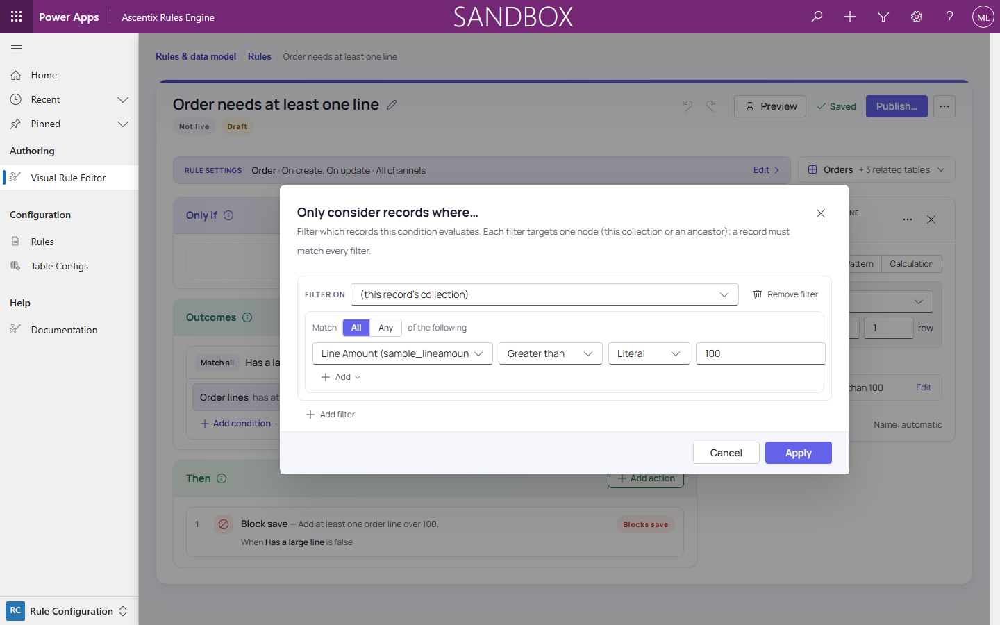
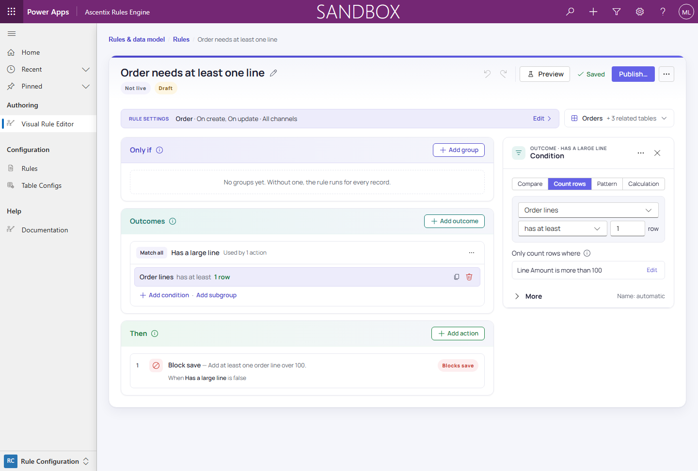

# Filtering a Condition's Child Records

When a condition targets a **child (collection) node**, its panel shows **Only consider rows where**
(**Only count rows where** for a Count rows condition). **Add filter** (or **Edit**) opens the
**"Only consider records where…"** dialog. The condition then evaluates only the child records that
match.

## How filters work

- Each filter targets **one node** and holds an AND/OR set of criteria on that node's columns.
- The first filter targets the condition's own child node. **Add filter** adds another, on the same
  node or on an **ancestor node** (to filter by a related record's columns).
- A child record counts only if it matches **all** filters.

## Operators and values

| | |
|---|---|
| Operators | **Equals**, **Not equals**, **Greater than**, **Greater or equal**, **Less than**, **Less or equal**, **Contains**, **Does not contain**, **Is null**, **Is not null** (only those that fit the column's type) |
| Grouping | Each group has a **Match** **All** / **Any** toggle |
| Values | **Literal** (a value you type), or **From record** (a column of a related record, such as the order's due date) |
| Dates | Also **Date expression**: relative to when the rule runs ("now minus 90 days") or to another date ("the row's estimated close date plus 2 days") |

- A row whose date is empty, or whose related record is missing or has no date, doesn't match.
- For a window such as "in the next 120 days", add two criteria: on or after now, and on or before
  now plus 120 days.
- Date comparisons against a literal, "now", or a date on the rule's own record or a record it looks
  up are applied in the Dataverse query. A date expression based on a date on the same row is
  applied after the rows load.

### Which day it is

| Column kind | Compared as |
|---|---|
| **User Local** | Exact moments |
| **Date Only** | Calendar dates: "on or after yesterday" means any time yesterday |
| **Time Zone Independent** | Clock times with no time zone |

For Date Only and Time Zone Independent columns, set **Rule time zone** (rule settings →
**Evaluation**) so the rule knows which day it is. The default is UTC, so a rule used in Eastern
Canada moves to the next day at 8 pm (7 pm in winter). The same setting reads a date without a time
zone against a User Local column: "Created On on or after 2026-09-01" means midnight in the rule's
time zone.

## Examples

**Filter by a column on the child.** "Every line with status = Active must have amount > 0":
condition `amount > 0` on the order-line node, plus a filter on the order-line node
`status Equals Active`.

**Filter by a column on an ancestor.** "Every line must have amount > 0, for Northeast orders only":
condition `amount > 0` on the order-line node, plus a filter on the parent order node
`region Equals Northeast`.

## Has related rows… (existence filtering)

The filter's **Add ▾** menu offers **Condition**, **Group** and **Related-rows filter**. A
related-rows filter is satisfied when another related collection has a **count of matching rows**
in a range, for example "this order has at least one Active line item", without a separate Row
Count condition.

1. In **"Related rows collection"**, pick one of the rule's child-collection nodes. It's related to
   the filtered node through the ancestor they share (lines and shipments of the same order).
2. In **"How many matching rows?"**, pick the count:

   | Mode | Range |
   |---|---|
   | **At least one (exists)** | min 1 |
   | **None (does not exist)** | max 0 |
   | **At least N** | min N |
   | **At most N** | max N |
   | **Exactly N** | min and max N |
   | **Between N and M** | min N, max M |
   | **Custom (min / max)** | the bounds, set directly |

3. Add the **sub-filter**: criteria on the related collection's columns. Its **Add** menu offers
   only **Condition** and **Group** (one level of nesting).

The same option is in an aggregate's **"Filter this aggregate…"** builder (*Field Mapping* →
*Filtering an aggregate*).

**Example.** "Only consider a line when its order also has an expedited shipment": on the
order-line filter, **Add** → **Related-rows filter**, pick **shipments**, **At least one (exists)**,
sub-filter `type Equals Expedited`. Switch to **None (does not exist)** for "…has no expedited
shipment".
