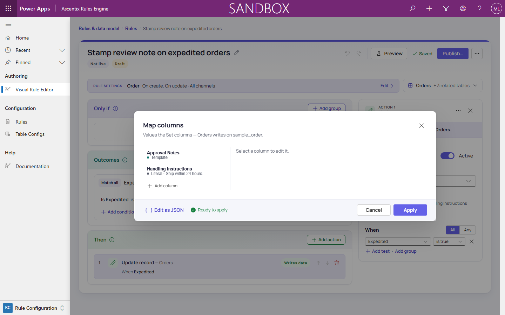

# Field Mapping

**Create Record** and **Update Record** actions set the target's columns in the **Map columns**
dialog: **"Edit columns…"** under **Columns to set** in the action panel. **Deactivate Record**
uses the same dialog (under **Status reason (optional)**) only to set **Status Reason**
(`statuscode`); left unmapped, the table's default inactive status applies.

## The Map columns dialog

The left rail lists each mapped column with a **Source · value** summary (for example "Literal ·
Handle with priority."). Select one to edit its **Column** and **Source** on the right.

| Source | Sets the column to |
|---|---|
| **Literal** | A value typed in an editor that fits the column's type |
| **From this record** | A column of the triggering record |
| **From related record** | A column of a related table-config node |
| **Current row** | A column of the row this write is for. Only on set Update, Delete or Deactivate actions, and Create Record **For each row of** a collection. For a lookup, **"Link to the current row itself"** points it at the row record (a follow-up task's Regarding pointing back at the contact row) |
| **Text template** | Text with `{root.<column>}`, `{node:<tableconfig-guid>.<column>}` and, where **Current row** is available, `{row.<column>}` tokens. A preview shows the result as you type |
| **Date calculation** | Date columns only: "now" or a date column, plus or minus an amount and unit |
| **Link to a record** | Lookup, Customer or Owner columns only: a chosen record's own reference, such as a note's Regarding pointing at the root record. Pick "this record" or a related node that resolves to one record. Stored as `{ "target": "objectid", "source": "ref", "node": "<tableConfigId>" }` |
| **Calculation** | Integer or decimal columns only: an arithmetic expression (below) |

**Add column** adds an entry; **Remove column** removes the selected one. **Apply** saves the
mapping to the action, **Cancel** discards it. **"Edit as JSON"** shows the stored field-mapping
JSON; switching back re-reads it.

## Calculation

A calculation computes a number from an expression.

| Element | Syntax |
|---|---|
| Columns | `{root.<column>}` (triggering record), `{node:<tableconfig-guid>.<column>}` (related record) |
| Numbers | `42`, `3.5` |
| Operators | `+`, `-`, `*`, `/`, parentheses, and a leading `-` |

Example: `{root.sample_quantity} * {node:<product>.sample_price}`.

- Operands must be numeric. A non-numeric one fails the rule with "calculation operand 'X' is not a
  numeric value".
- If any operand is empty, or the expression divides by zero, the column is **left unchanged**.
- Integer targets round to the nearest whole number; decimal targets keep full precision.

### Aggregates over child collections

| Function | Result |
|---|---|
| `sum(node:<guid>.<column>)` | The total of the column across the collection |
| `avg(node:<guid>.<column>)` | The average |
| `min(node:<guid>.<column>)` | The smallest value |
| `max(node:<guid>.<column>)` | The largest value |
| `count(node:<guid>)` | The number of rows (no column) |

- The collection must be a **child collection** (one-to-many), not a single related record or the
  root.
- The column must be numeric; any other type fails at run time.
- Empty cells are ignored.
- On an empty collection, `sum` and `count` give `0`. `avg`, `min` and `max` give no value, so the
  column is left unchanged.

**Insert aggregate** in the calculation editor asks for the **Function**, the **Collection** and
(except for `count`) the **Column**, and inserts it at the cursor. Aggregates combine like any
operand: `sum(node:<lines>.lineamount) * (1 + {root.taxrate})`.

### Filtering an aggregate

Below the expression, the **Aggregates** card lists each aggregate with its function, collection
and column. **"Only rows where…"** opens the same filter builder as condition filters; **Clear**
removes the filter. Only aggregates can be filtered, not `{root.…}` or `{node:…}` operands.

- Criteria use the same operators, and compare against a literal, another record's column or, for
  dates, a **Date expression** (*Filtering a Condition's Child Records*).
- **Related-rows filter** adds an existence check on another collection: only sum lines whose order
  also has an expedited shipment.
- A filter that matches no rows counts as an empty collection.

Example: `sum(node:<lines>.amount)` with the filter `status Equals Active` sums active lines only.

See *Building Actions* for the other action types.
