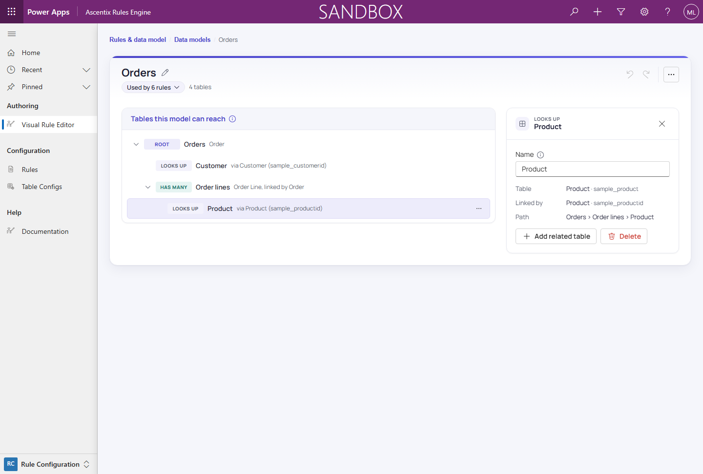

# Table Configuration Tree

A **data model** (stored as a **table configuration**, and also called a
**data map** or **traversal tree**) describes how the engine reaches
related data starting from a **root table** out to whatever related tables
a rule needs to look at. Every condition and action node picker in the
earlier pages, and the data model chip shown in *Editor Layout*, are built
on top of one of these trees. The Rule Builder calls it a **data model**
throughout: the hub's **Data models** tab, the data-model editor, and the
rule editor.

## Node types

Every node is one of three types, shown as a tag on its row in the tree
(**ROOT**, **LOOKS UP**, **HAS MANY**):

- **Root Table** (**ROOT**): the tree's starting point, and the table the
  rule itself is bound to. There's exactly one per data model.
- **Lookup Table** (**LOOKS UP**): a **many-to-one** related table, reached
  through a parent lookup column on the current node's table (for example, an
  order reaching the customer it belongs to via its customer lookup). Its row
  reads, for example, "via Customer (sample_customerid)".
- **Child Table** (**HAS MANY**): a **one-to-many** related table, reached
  through a child link field back to the current node. Its row reads, for
  example, "Order Line, linked by Order".

The tree is titled **Tables this model can reach**. Indentation in the tree
shows **traversal depth**, and the tree works from the keyboard: arrow keys
move between tables (Right and Left expand and collapse), and Enter selects. A lookup reached from
underneath a child node gives a multi-level path, as in
Order → Order Line → Product, where Product hangs off the Order Line
**child** node rather than off the root.

## Data models are shared

A data model is **shared and reusable**: more than one rule can
point at the same data model. Editing a data model's tree (adding a
related node, for example) affects **every rule** that uses it. The
editor's header shows a **Used by N rules** chip (click it to list those
rules, each marked **Live** or **Draft**, and open one) alongside the table
count.

Clicking **Save…** doesn't save straight away: a **Save shared data
model?** confirmation names your change and lists every rule that uses the
model, saying which tables of it each one reads (for example, "reads
Customer in 2 conditions") or **not affected**. Live rules keep their
published copy until they are republished.

## Selecting a node

Clicking a table in the tree opens its panel, showing:

- **Name**: an editable label for the node, shown in condition and action
  pickers in every rule that uses this model.
- **Table**: the Dataverse table the node resolves to.
- **Linked by**: the column this node is reached through from its parent
  (the parent's lookup column, or the child's link field).
- **Path**: the full path from the root down to this node.
- **Used by N rules**: the rules that read this table, with how many of
  their conditions and actions do.

The panel also has an **Add related table** button, which attaches a
further lookup or child table underneath it and is how multi-level paths
get built, and a **Delete** button. The same actions are on each row's ⋯
menu (**Add related table…**, **Rename**, **Delete**). **Add related
table** opens a searchable list of the table's relationships, grouped
**LOOKS UP · ONE RECORD** and **HAS MANY · ROWS**. The **Root** node can't
be deleted, and a table can't be deleted while it still has tables under
it (*Delete the tables under it first.*) or while rules use it (*Can't
delete: used by N rules.*).

## Opening a data model

You can reach the data-model editor three ways:

- **Edit data model**: from the data model chip in a rule's editor,
  opens that rule's data model.
- **Data models**: a tab on the hub, listing every data model (see
  *The Hub*).
- **Table Configs**: an entry in the app sitemap.

In the editor, the breadcrumb (**Rules & data model** / **Data models**)
leads back to the hub, and the pencil beside the name (**Rename data
model**) renames it.

See *Metadata Pickers* for how the "Add related table" relationship list is
kept limited to relationships that actually exist, and *Building
Conditions* for how a condition picks which node in the tree it
evaluates against.
