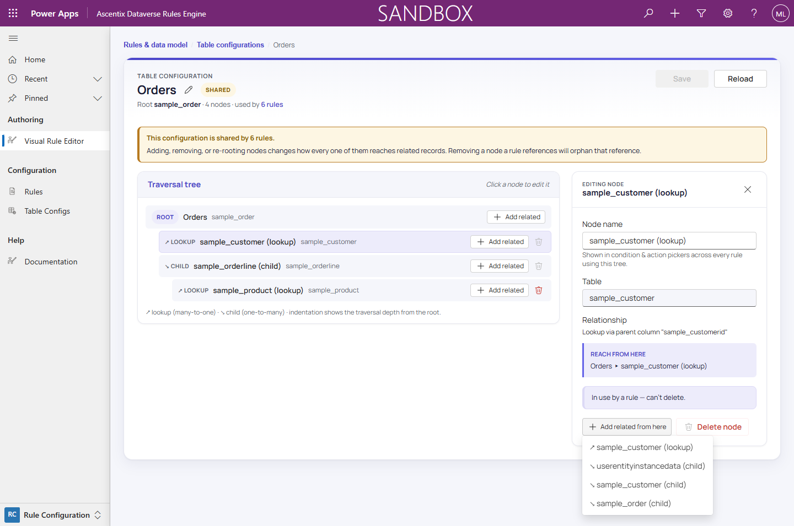

# Metadata Pickers

Throughout the editor, wherever you're asked to choose a table, column,
relationship, choice, or option-set value, the picker is populated from
**live Dataverse metadata** rather than a fixed list, scoped to what
you're editing: comparison columns come from the condition's table-config
node, relationships from that node's table, choice values from the column
being compared. A reference that does slip past the pickers (for example,
a comparison column deleted from the table after a condition was built
around it) is caught by validation; see *Validating & Publishing* for how
those metadata-aware checks work.

## Add related, live

The table-config **"Add related from here"** picker is built from the
node table's actual relationships, each labeled with a lookup or child
icon.

See *Table Configuration Tree* for how these relationship picks build out
a traversal tree, and *Building Conditions* / *Comparison Value Sources*
for the column and field-reference pickers that draw on the same
metadata.

## Searching pickers

The **Table** and **Column** pickers throughout the editor are
type-to-filter comboboxes: start typing to narrow the list by display
name or logical name ("Type to filter tables" / "Type to filter columns"
placeholders). Each also has a **"Custom tables only"** / **"Custom columns
only"** checkbox that hides system metadata.

## Browsing for a record

Lookup value fields, a condition's Literal value in *Building Conditions*
and a field mapping's Literal value in *Field Mapping*, show a
**Browse…** button next to the inline search box. Browse… opens the
**Record Picker** modal:

- A **view selector**: pick one of the table's saved views; the chosen
  view sets the base filter and which columns appear in the results grid.
- **In-view text search**: narrows the view's results by name as you type.
- An **advanced filter**: a nested AND/OR filter builder, the same
  building blocks used for condition groups, letting you filter by any
  column on the table rather than just the primary name.
- A **paged results grid**, built from the selected view's columns, with a
  **Load more** button to fetch additional pages. Selecting a row and
  clicking **Select** resolves the lookup.

The inline quick-search stays available for fast typing on small tables.
Browse… is there for tables with many records, duplicate names, or when you
need to filter by something other than the primary name.
