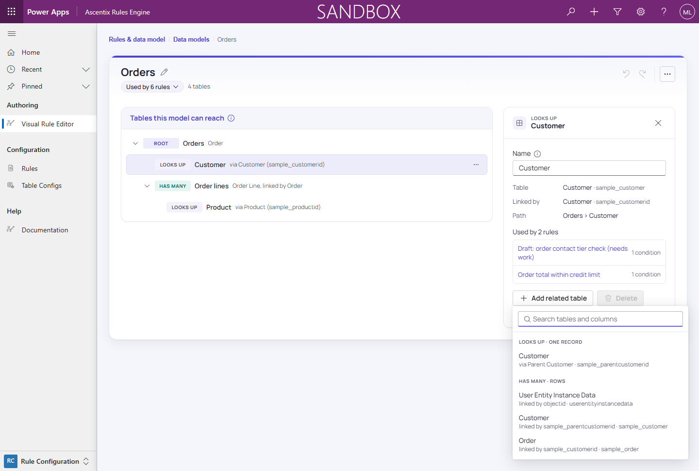

# Metadata Pickers

Every picker for a table, column, relationship or choice value is filled from **live Dataverse
metadata**, scoped to what you're editing: a condition's columns come from its node's table, a
choice's values from the column. A reference that goes stale later, such as a column deleted after
a condition used it, is caught by validation (*Validating & Publishing*).

## Add related table

The data-model editor's **"Add related table"** lists the table's actual relationships, grouped
**LOOKS UP · ONE RECORD** and **HAS MANY · ROWS**, with a **Search tables and columns** box. See
*Table Configuration Tree*.

## Searching pickers

**Table** and **Column** pickers filter as you type, by display or logical name. **"Custom tables
only"** / **"Custom columns only"** hides system metadata.

## Browsing for a record

A lookup value (a condition's **a value** tab, or a Literal in *Field Mapping*) has an inline search
and a **Browse…** button. **Browse…** opens the **Record Picker**, for large tables, duplicate names,
or filtering by more than the name:

- A **view selector**: the view sets the base filter and the grid's columns.
- A **text search** within the view.
- An **advanced filter**: an AND/OR builder over any column.
- A **results grid** with **Load more**.
