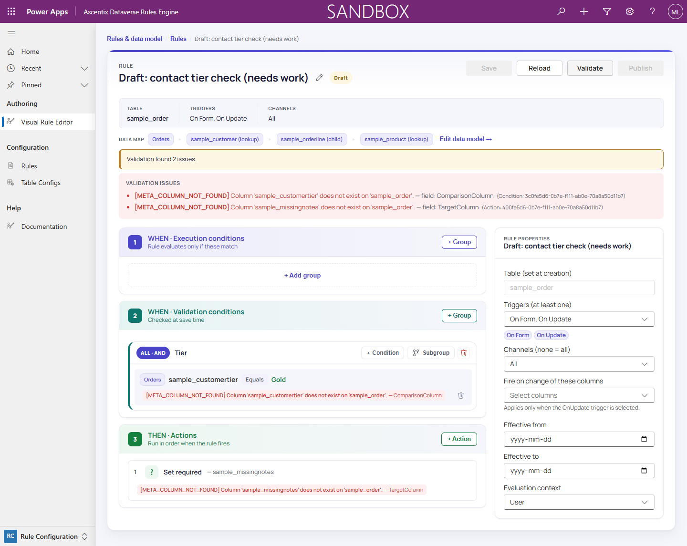
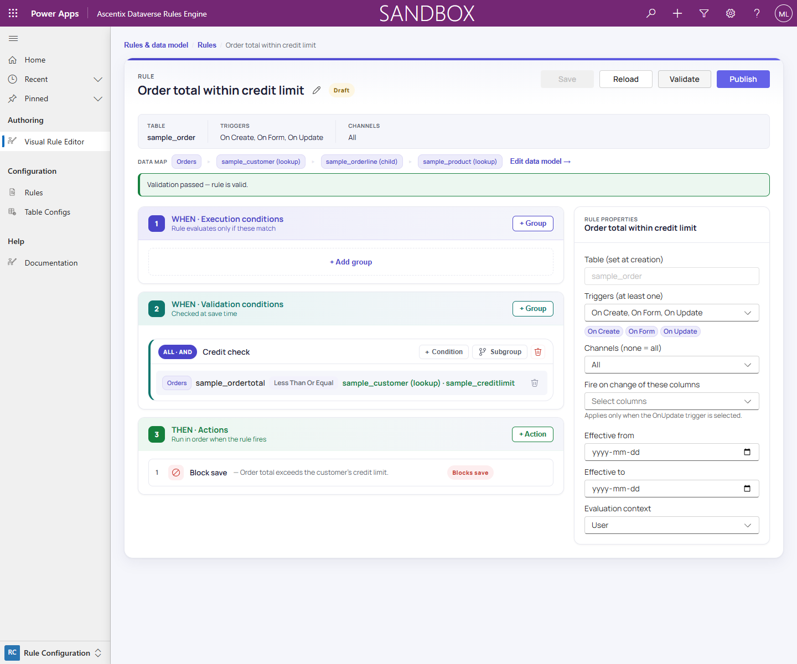

# Validating & Publishing

Publishing is **gated** on validity: a **Draft** rule only becomes
**Published** if it validates cleanly. **Validate** reports what is
standing in the way.

When there are unsaved edits, the button reads **Save & validate**: it first saves
the Draft, then validates the persisted result. On a clean rule it reads **Validate**.
Published rules are read-only in the builder; unpublish before editing them. During
that editing period the rule is not enforced. See *Saving & Concurrency*.

## Validation layers

Validation runs three layers of checks, in order, collecting every issue
found rather than stopping at the first one:

- **Structural**, the rule's basic shape: it has at least one condition
  and one action, no condition group is empty, and every condition/action
  has the fields its type requires.
- **Traversal integrity**: every table-config node a condition or action
  points at exists in the rule's tree and is reachable from the root, and
  single-cardinality requirements (like a Field Reference right-hand node)
  are respected.
- **Metadata-aware**: every referenced table and column actually exists,
  and is creatable, updatable, or readable as needed for how it's used
  (for example, a Create Record mapping target must be creatable; a
  comparison column must be readable).

All three layers report **errors**, which block publishing. Issues can also
carry a **Warning** severity, which is advisory and does not block: a Row
Count minimum that can never pass at Create (`STRUCT_ROWCOUNT_ON_CREATE`),
and the privilege requirement stated for a gated System-context write action
(`SEC_SYSWRITE_REQ`).

## Reading the issues panel

Each issue shows a **code**, a human-readable **message**, and the
**field or node** it applies to. Errors are also marked **inline** on the
offending row.

Below, a condition's **Comparison column** and an action's **Target
column** both reference columns that no longer exist, raising two
`META_COLUMN_NOT_FOUND` errors.

Once every issue is resolved, Validate shows a green **"Validation
passed. The rule is valid"** banner and **Publish** becomes available.

## Publishing is enforced

Publishing moves a rule from **Draft** to **Published**. Only
**Published** rules are enforced at runtime; a Draft rule, however valid,
doesn't run. See *Rule Lifecycle* for the full Draft/Published/Archived
flow, and *Runtime Enforcement* for how a published rule's actions are
actually applied.
