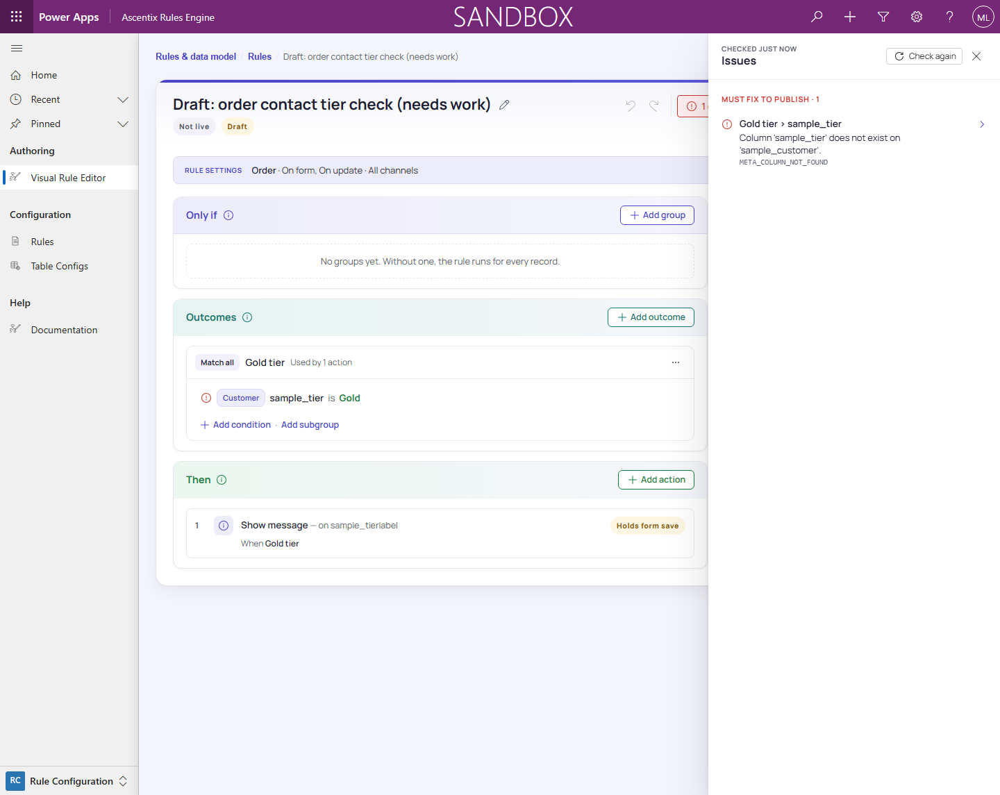
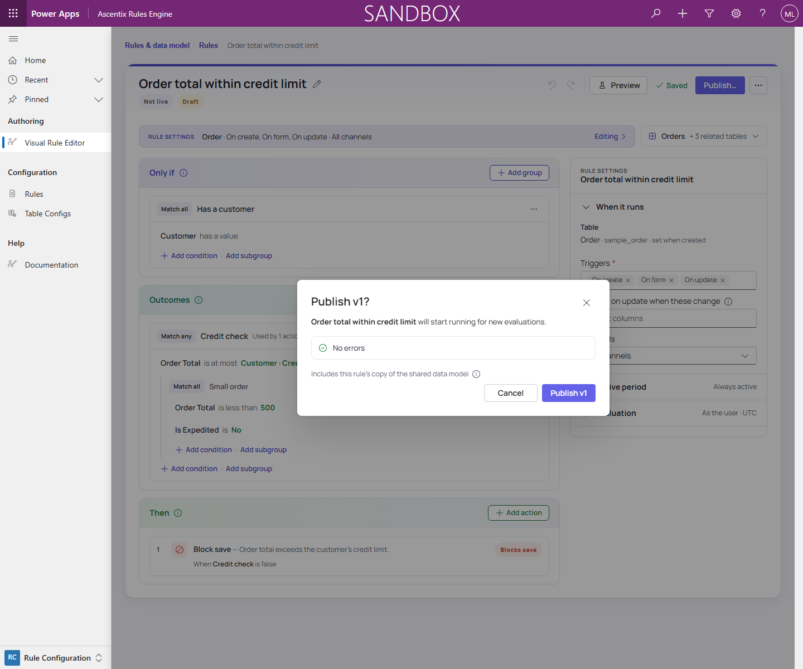

# Validating & Publishing

Publishing is **gated** on validity: a **Draft** rule only becomes
**Published** if it validates cleanly. **Check for issues**, in the header's
**More actions** (⋯) menu, reports what is standing in the way.

When there are unsaved edits, **Check for issues** first saves the Draft, then
validates the persisted result. If nothing is wrong, a *No issues found* message
appears; otherwise the **Issues** drawer opens. Published rules remain active while
you edit and save their draft. Check the draft, then **Publish…** to replace the live
revision. **Publish…** itself saves and checks first (the button reads **Checking…**
meanwhile), so publication always revalidates the current saved configuration,
including shared data models. Changes since a previous check do not block publication
when the current definition is valid. See *Saving & Recovery*.

## Validation layers

Validation runs three layers of checks, in order, collecting every issue
found rather than stopping at the first one:

- **Structural**, the rule's basic shape: it has at least one condition
  and one action, no condition group is empty, and every condition/action
  has the fields its type requires.
- **Traversal integrity**: every table-config node a condition or action
  points at exists in the rule's tree and is reachable from the root, and
  single-cardinality requirements (like the node of an **another column** comparison)
  are respected.
- **Metadata-aware**: every referenced table and column actually exists,
  and is creatable, updatable, or readable as needed for how it's used
  (for example, a Create Record mapping target must be creatable; a
  comparison column must be readable).

All three layers report **errors**, which block publishing. Issues can also
carry a **Warning** severity, which is advisory and does not block: a Row
Count minimum that can never pass at Create (`STRUCT_ROWCOUNT_ON_CREATE`).

## Reading the Issues drawer

Once a check has found issues, the header shows an issues button with the
error count (and a warning count), for example **2 errors**. It opens the
**Issues** drawer, which lists errors under **Must fix to publish** and
warnings under **Warnings** (warnings don't block publishing). Each issue
shows a human-readable **message**, its **code**, and the **field or node**
it applies to; select one to go to that field. **Check again** re-runs the
check. If you edit after a check, the drawer says *You've edited since this
check. Results may be out of date.* Errors are also marked **inline** with an
issue icon on the offending row.

The editor also flags incomplete items as you build, worded as the next
step to take, for example *Choose a column to compare.* or *Enter a value to
compare against.*

Below, a condition's **Column** and an action's **Target
column** both reference columns that no longer exist, raising two
`META_COLUMN_NOT_FOUND` errors.

## Outcome and Fires when checks

Outcomes (the top-level validation groups) and each action's Fires when condition (its **When**
section) get their own checks:

- **`OUTCOME_UNNAMED`** (error): "Name this outcome."
- **`OUTCOME_DUPLICATE_NAME`** (error): "Another outcome is already named "<name>"." Names are
  compared ignoring upper and lower case.
- **`ACTION_NO_TREE`** (error): "Choose when this action fires." The action's **When** section is
  not set.
- **`ACTION_TEST_UNKNOWN_OUTCOME`** (error): "A test in "Fires when" refers to an outcome this
  rule doesn't have."
- **`ACTION_EMPTY_GROUP`** (error): "A group in "Fires when" has no tests or groups." An empty
  root **All** group is fine; it means "Always, when the rule runs".
- **`OUTCOME_UNUSED`** (warning): "No active action uses this outcome. It is still evaluated and
  reported." Only active actions count, so an outcome tested only by an inactive action gets it
  too. It does not block publishing.

## Set-action errors

A set action (Update Record, Delete Record or Deactivate Record on a collection, or Create Record
creating **For each row of** one) adds a few checks of its own, all Error severity:

- **`STRUCT_ACTION_FILTER_TARGET`**: a Rows filter must filter the action's own target rows, and
  only a set action can have a Rows filter at all.
- **`STRUCT_ROW_SOURCE_NOT_SET`**: the **Current row** source — a field mapping's `row` source, or
  a `{row.<column>}` token anywhere it can appear (a Show Message/Block message, one of its
  per-language translations, or a Template condition's comparison value) — can only be used by an
  action that writes a set of rows.
- **`STRUCT_DEACTIVATE_MAPPING`**: Deactivate Record's field mapping may only set **Status
  Reason**; any other mapped column is refused.
- **`META_TABLE_NOT_DEACTIVATABLE`**: Deactivate Record's target table can't be deactivated by a
  rule — either it has no `statecode`, or it changes state only through its own dedicated message
  (Opportunity, Case, Quote, Order and Invoice are refused outright).

A set action's **row-source columns** (the columns a `row` mapping or a `{row.…}` token reads) are
checked only for existence and readability, the same as any other read; type compatibility with
the target is the editor's own picker and the resolver's concern, not validation's.

Once every issue is resolved, **Check for issues** shows **No issues found**
and **Publish…** can go ahead.

## The Publish dialog

**Publish…** saves the draft, checks it, and then opens a dialog:

- If there are errors, the dialog is titled **Fix N errors to publish** and
  lists them, each with a **Go to field** link; **Open issues** opens the
  **Issues** drawer.
- Otherwise it is titled **Publish vN?**, notes **No errors**, any warnings
  (with **View**), and how many changes there are since the live version
  (with **Review**). Confirm with **Publish vN**. A *vN is live* message then
  confirms the publish, with a **View runs** link.

## Publishing is enforced

Publishing creates a numbered revision and enables the rule. Republishing a live
rule atomically replaces its active revision. Only
**Published** rules are enforced at runtime; a Draft rule, however valid,
doesn't run. See *Rule Lifecycle* for the full Draft/Published/Archived
flow, and *Runtime Enforcement* for how a published rule's actions are
actually applied.

## Testing a published rule against a record

Once a rule has a published revision, the header shows a **Run** button (*Running Rules On
Demand*): whenever the rule has ever been published, whether or not it's currently Published or
has unsaved Draft edits. Clicking **Run** (or **Preview on a record…** in its **More run
options** menu) opens the **Run** dialog on its **Preview on a record** tab. Pick a **Record**
(type to search, or choose **Advanced search…**) and an **As if** trigger, then click **Run
preview**. It reports what would fire — the same report-only, nothing-is-saved evaluation as
`asx_RunRules`, always against the **published** version of the rule, never the unsaved draft
you're looking at. See *Custom APIs* → `asx_RunRules` for the underlying report shape, including
the `ChangeSet` summary the preview renders for set actions.

The result opens with a verdict: **Save would go through** (with a summary of what would be
written), **Save would be blocked**, or **Nothing would happen** (no action of this rule fired).
When a Block fires on the record, from this rule or another rule on the same record, the verdict is
**Save would be blocked**, with the Block's message and "Nothing would be written.", and this
rule's write actions show **Skipped, blocked**.

Below the verdict, **OUTCOMES** lists this rule's outcomes, each with a tick or cross icon (true
or false). The values are those of the normal run; a rule held back by its **Only if** conditions
reports none. Then every action of the rule is listed in rule order, marked **Fired**, **Didn't
fire**, or **Skipped, blocked**; a fired write action expands to show the rows it would write. If
other rules fired too, a line such as "2 other rules also fired on this record." lets you show
them.
