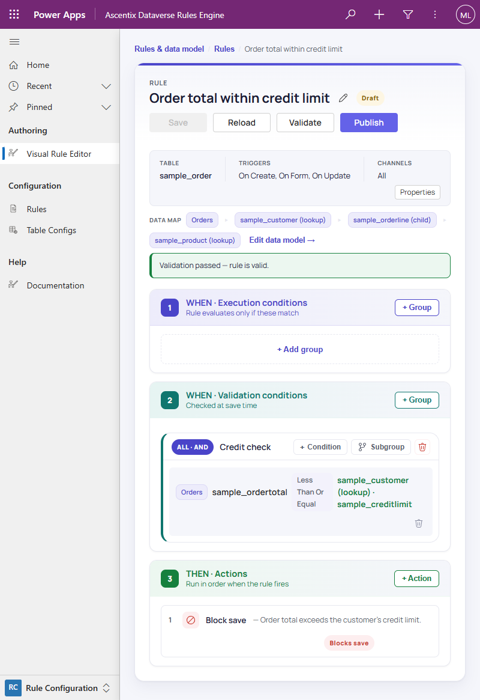

# Accessibility & Responsive Layout

The editor is keyboard-operable and labelled for assistive technology
throughout, and its layout reflows rather than forcing horizontal
scrolling.

## Keyboard and screen reader support

Every interactive element in the editor (tree rows, condition and
action rows, buttons, and the breadcrumb) is keyboard-operable, with
accessible names and labels for assistive technology. Status regions like
the validation issues panel are announced as they update, so keyboard and
screen-reader users can drive the same workflows described in this guide
without a mouse.

## Responsive layout

The editor's layout **reflows on narrower viewports** rather than forcing
horizontal scrolling:

- **Header actions**: the Save / Reload / Validate / Publish cluster
  wraps below the rule name instead of crowding it.
- **The data map**: the DATA MAP row's chips wrap onto additional lines
  as the tree's node list grows too wide for one row.
- **Condition and action rows**: long condition and action rows (for
  example, an operator plus a field-reference value) stack their pieces
  vertically instead of truncating.
- **Side panels**: the node inspector and other side panels move below
  the tree rather than squeezing into a shrinking column beside it.

