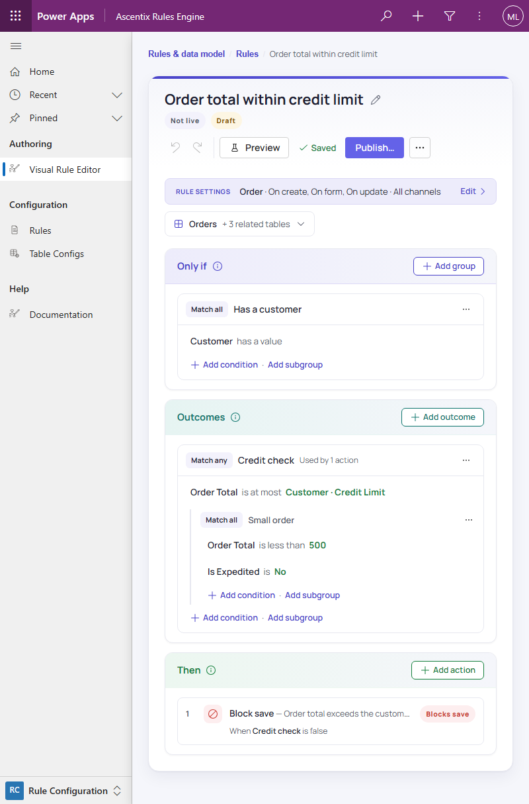

# Accessibility & Responsive Layout

The editor is keyboard-operable and labelled for assistive technology
throughout, and its layout reflows rather than forcing horizontal
scrolling.

## Keyboard and screen reader support

Every interactive element in the editor (tree rows, condition and
action rows, buttons, and the breadcrumb) is keyboard-operable, with
accessible names and labels for assistive technology. A condition's
**Duplicate condition** and **Delete condition** buttons, and an action's
**Move up**, **Move down** and **Delete action** buttons, appear on keyboard
focus as well as on hover, and the data-model tree is navigated with the
arrow keys. Status regions like the error and warning counts of a **Check
for issues** run are announced as they update, so keyboard and
screen-reader users can drive the same workflows described in this guide
without a mouse.

## Responsive layout

The editor's layout **reflows on narrower viewports** rather than forcing
horizontal scrolling:

- **Header actions**: the Undo / Redo / Run / Save / Publish… / More
  actions cluster wraps below the rule name instead of crowding it.
- **Rule settings and data model**: the **Rule settings** strip and the data
  model chip wrap onto separate lines when they don't fit side by side.
- **Condition and action rows**: long condition and action rows (for
  example, an operator plus a field-reference value) stack their pieces
  vertically instead of truncating.
- **Side panels**: the rule settings, condition, action and table panels
  open as an overlay rather than squeezing into a shrinking column beside
  the tree.

