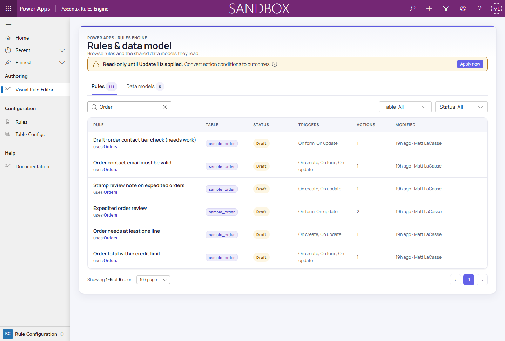
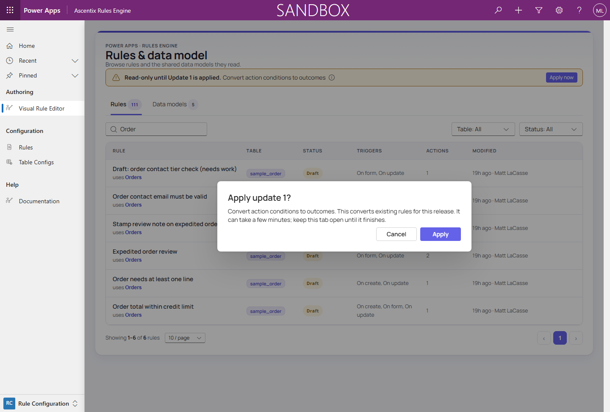

# Data Updates

Some releases change how rules are stored, so existing rules must be converted once. The release
ships that conversion as a numbered **data update**, applied from the Rule Builder. Most releases
carry none, and an update only appears where it has something to convert: a new installation never
sees one. Importing the release is safe on its own: published rules keep enforcing.

## How you see one

While an update is waiting, the hub and the editors show a bar with the update's title:

> Read-only until Update N is applied.

Until it's applied:

- The Rule Builder is **read-only**. Rules can be viewed, but **New rule**, **Duplicate**,
  **Delete** and the editing controls are hidden.
- **Publishing is refused**: "An administrator must apply data update N before rules can be
  published."
- Enforcement, **Run now** and schedules keep working.

Only a **System Administrator** or **System Customizer** sees **Apply now**. Everyone else sees the
bar without it, and its info tip says to ask one (*Security Roles*).

## Applying an update

1. Choose **Apply now**, then **Apply** in the confirmation, which names the update.
2. **Keep the tab open.** It runs in steps of up to a minute and shows how many items are converted
   and failed so far. It can take a few minutes.
3. When it reports *N converted, N failed*, choose **Close**. The page reloads and rules are editable
   again.

Closing the tab part way loses nothing: the update saves its position after every step. Choose
**Apply now** again to carry on. Several waiting updates run in order, lowest number first.

## Completed with failures

An item that can't be converted is recorded, skipped and left as it was; the rest are converted. An
administrator then sees:

> Update N · title finished with N failed item(s).

It lists each failed item with the reason (the first 50). Rules are editable again. Fix the cause the reason names, then choose **Retry failed items**: the update
runs again from the start. **Dismiss** hides the notice until the next apply finishes or the Rule
Builder is reopened. An update whose items all fail finishes the same way (*Troubleshooting*).

## Applying updates from a pipeline

A deploy pipeline or script can apply updates by calling the `asx_ApplyDataUpdates` Custom API until
it reports `Done` (*Custom APIs*). Ours does this after every plug-in deploy.
